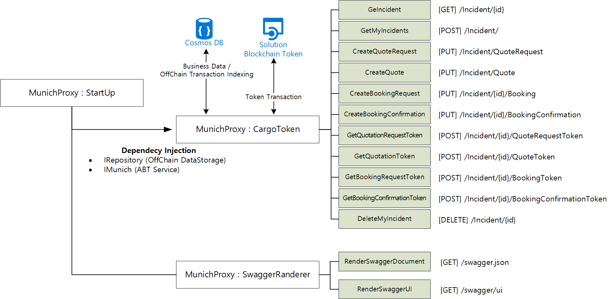

# Source Code Deployment

This folder contains a YAML script that can be used to upload functions into your [Azure Functions](https://azure.microsoft.com/en-us/services/functions/) resource that you deployed in the previous step. The diagram below shows how the source code we deploy will interact with the other solution components.

 
## Prerequisites
Fundamental knowledge and access to [Azure Pipelines](https://azure.microsoft.com/en-us/services/devops/pipelines/)

## Steps for Source Code Deployment via Azure Pipelines

To run the [Pipeline](./azure-pipelines.yml):

1. Copy the [src](./src) folder and [pipeline script](./azure-pipelines.yml) into an [Azure DevOps](https://azure.microsoft.com/en-us/services/devops/) repository.
2. Create a new pipeline and connect it to the repository.
3. The page should now be opened to the pipeline, double click on the settings header for the task 'AzureFunctionApp@1'
4. In the right panel pop-up, fill-out the following fields:
    - Azure subscription: <--subscription ID-->
    - App type: Function App on Windows
    - App name: <--app name-->
    - Check the "Deploy to Slot or App Service Environment"
    - Resource Group: <--resource group-->
    - Slot: Production
5. Click "Add" at the bottom of the popout.
6. Click "Save and Run", create new branch for the commit, and run the pipeline. Accept access to the subscription if it is requested.