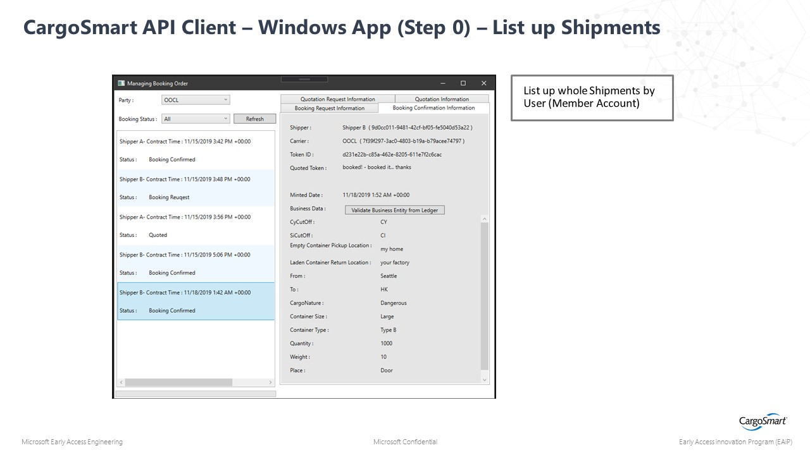
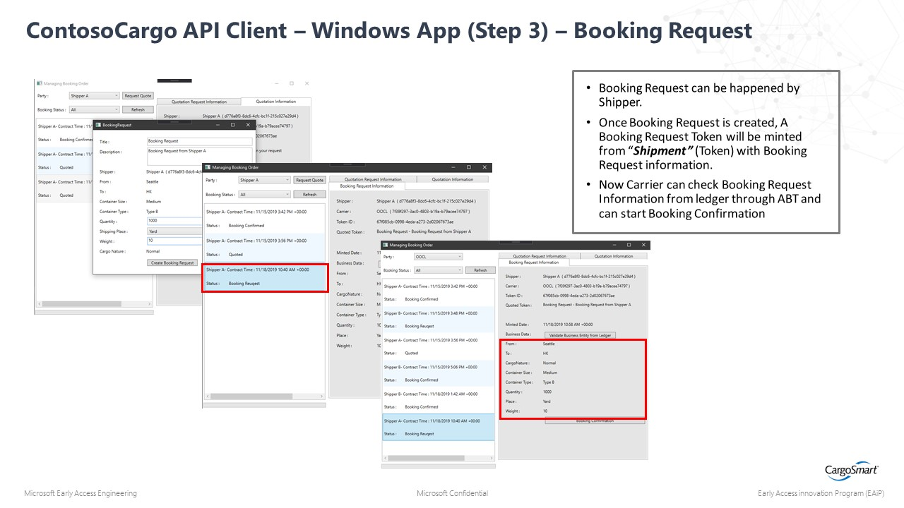
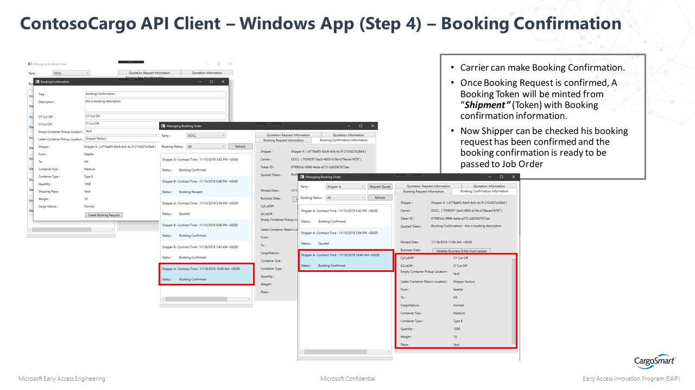

# Application Deployment

This folder contains documentation on how to run the Digital Documentation Shipping Industry Solution

 
## Prerequisites
Fundamental knowledge and access to [Visual Studio](https://visualstudio.microsoft.com/)

## Steps for adding Azure configuration to Client Application

To run the [source code](../01_Source_Code_Deployment/src):

1. Clone/download the [source code](../01_Source_Code_Deployment/src) onto your computer and open the folder in Visual Studio.
2. Open the [ContosoCargo.DigitalDocument.TokenService.sln](../01_Source_Code_Deployment/src/ContosoCargo.DigitalDocument.TokenService.sln).
3. Navigate to WindowsApp > ContosoCargo.DigitalDocument.Application.WindowsClient > App.config.
4. Replace HostKey and ServiceEndpoint with your Azure Functions values.
     - Don't forget **/api** on the end! (e.g. _https://contosocargo.azurewebsites.net/api_)
5. Save and run the Windows Client as your start up project.

## How to use the Application

The first time the Client App will open up to 'Contoso Cargo' as the Party and there should be no quotes created yet. Once there are shipping quotes, the client should look like this:

### 1. Start with a shipper creating a quote request:

### 2. The carrier will repsond with a quotation:

### 3. The shipper will book the request:

### 4. The carrier will confirm the request:
