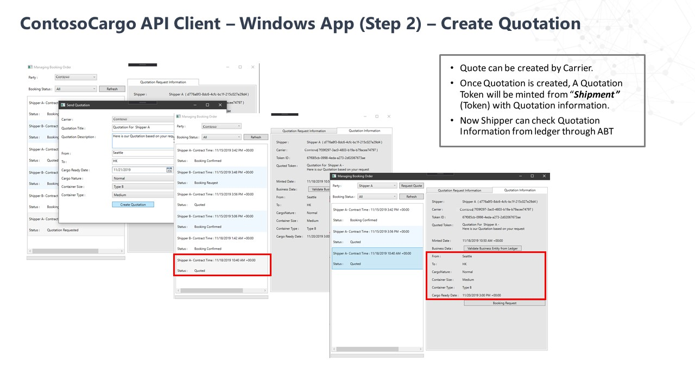

# Application Deployment

This folder contains documentation on how to run the Digital Documentation Shipping Industry Solution

 
## Prerequisites
Fundamental knowledge and access to [Visual Studio](https://visualstudio.microsoft.com/)

## How to run Client Application in Azure

To run the [source code](../01_Source_Code_Deployment/src):

1. Clone/download the [source code](../01_Source_Code_Deployment/src) onto your computer and open the folder in Visual Studio.
2. Open the [ContosoCargo.DigitalDocument.TokenService.sln](../01_Source_Code_Deployment/src/ContosoCargo.DigitalDocument.TokenService.sln).
3. Navigate to AzureFunctions > ContosoCargo.DigitalDocument.TokenService.Host > applications.settings.json.
4. Navigate to WindowsApp > ContosoCargo.DigitalDocument.Application.WindowsClient > App.config.
5. Replace HostKey and ServiceEndpoint with your Azure Functions values.
     - Don't forget **/api** on the end! (e.g. _https://contosocargo.azurewebsites.net/api_)
6. Set the Application.WindowsClient as your start up project and run the solution.

## How to run Client Application locally

To run the solution locally you will need access to [Azure Functions Core Tools](https://docs.microsoft.com/en-us/azure/azure-functions/functions-run-local?tabs=windows%2Ccsharp%2Cbash) to host the source code. If you do not have this installed, running ContosoCargo.DigitalDocument.TokenService.Host will automatically install the program.
If you choose to run the Cosmos DB instance locally you will need to also have [Azure Storage Emulator](https://docs.microsoft.com/en-us/azure/storage/common/storage-use-emulator) installed.

1. Repeat steps 1-3 for the Azure Application deployment.
2. Replace Offchain_Connectionstring with your emulator Cosmos DB connection string.
3. Navigate to WindowsApp > ContosoCargo.DigitalDocument.Application.WindowsClient > App.config.
4. Set the ServiceEndpoint to http://localhost:7071/api in App.config.
5. Set the following as start up projects:
    - TokenService.Host should be set to "Start"
    - Application.WindowsClient should be set to "Start without debugging"

## How to use the Application

The first time the Client App will open up to 'Contoso Cargo' as the Party and there should be no quotes created yet. Once there are shipping quotes, the client should look like this:

### 1. Start with a shipper creating a quote request:

### 2. The carrier will respond with a quotation:

### 3. The shipper will book the request:

### 4. The carrier will confirm the request:
