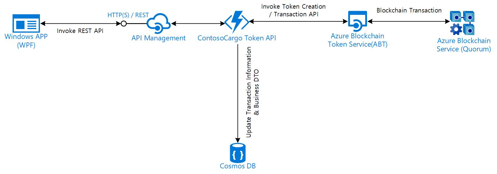

# Digital Documentation Shipping Industry Solution Accelerator Guide

## About this repository
This accelerator was built to provide developers with all of the resources needed to quickly build an initial Digital Documentation Shipping Quote system. Use this accelerator to jump start your development efforts with Blockchain in Azure.

This repository contains the steps, scripts, code, and tools to create a Blockchain application.
- 00_Resource_Deployment will create the solution resources in Azure (Functions, Blockchain Service, and Cosmos DB).
- 01_Source_Code_Deployment will configure and deploy the client app as well as the functions to the Azure resource.
- 02_Application_Deployment will deploy and host your application your subscription.

## Prerequisites
In order to successfully complete your solution, you will need to have access to and or provisioned the following:
1. Access to an Azure subscription
2. Visual Studio 2017 or 2019
3. Azure CLI installed
4. Access to Azure Pipelines
5. (_for local deployment only_) Azure Storage Explorer

## Azure and Blockchain
The directions provided for this repository assume fundamental working knowledge of Azure, Cosmos DB, Azure Fuctions, Azure Blockchain Service, and Azure Pipelines.

For additional training and support, please see:
 1. [Azure Cosmos DB](https://docs.microsoft.com/en-us/azure/cosmos-db/introduction)
 2. [Azure Functions](https://azure.microsoft.com/en-us/services/functions/) 
 3. [Azure Blockchain Service](https://azure.microsoft.com/en-us/services/blockchain-service/)
 4. [Azure Pipelines](https://azure.microsoft.com/en-us/services/devops/pipelines/)

## Getting Started and Process Overview
Clone/download this repo onto your computer and then walk through each of these folders in order, following the steps outlined in each of the README files.  After completion of all steps, you will have a working end-to-end solution with the following architecture:

### [00 - Resource Deployment](./00_Resource_Deployment)
The resources in this folder can be used to deploy the required resources into your Azure Subscription. This can be done either via the [Azure Portal](https://portal.azure.com) or by using the [PowerShell script](./00_Resource_Deployment/deploy.ps1) included in the resource deployment folder.

After deployed, you will have a Cosmos DB account, Azure Function (including an App Service Plan and Storage), and Blockchain Service deployed in your specified resource group.

### Deploy via Azure Portal
If you're satisfied with all the presets in [azuredeploy.json](./azuredeploy.jsosn), you can deploy the resources by clicking the button below:

 

### [01 - Source Code Deployment](./01_Source_Code_Deployment)
This folder contains a YAML pipeline and the source code. The [pipeline](./01_Source_Code_Deployment/azure-pipelines.yml) will deploy the source code to the Azure Functions resource.

This pipeline will help you deploy the functions needed to handle the API calls for the quote and booking transactions.

### [02 - Application Deployment](./02_Application_Deployment)
This folder contains the documentation of how to configure the solution to your provisioned Azure resources and how to use the application.

## License
Copyright (c) Microsoft Corporation

All rights reserved.

MIT License

Permission is hereby granted, free of charge, to any person obtaining a copy of this software and associated documentation files (the ""Software""), to deal in the Software without restriction, including without limitation the rights to use, copy, modify, merge, publish, distribute, sublicense, and/or sell copies of the Software, and to permit persons to whom the Software is furnished to do so, subject to the following conditions:

The above copyright notice and this permission notice shall be included in all copies or substantial portions of the Software.

THE SOFTWARE IS PROVIDED AS IS, WITHOUT WARRANTY OF ANY KIND, EXPRESS OR IMPLIED, INCLUDING BUT NOT LIMITED TO THE WARRANTIES OF MERCHANTABILITY, FITNESS FOR A PARTICULAR PURPOSE AND NONINFRINGEMENT. IN NO EVENT SHALL THE AUTHORS OR COPYRIGHT HOLDERS BE LIABLE FOR ANY CLAIM, DAMAGES OR OTHER LIABILITY, WHETHER IN AN ACTION OF CONTRACT, TORT OR OTHERWISE, ARISING FROM, OUT OF OR IN CONNECTION WITH THE SOFTWARE OR THE USE OR OTHER DEALINGS IN THE SOFTWARE

## Contributing

This project welcomes contributions and suggestions.  Most contributions require you to agree to a
Contributor License Agreement (CLA) declaring that you have the right to, and actually do, grant us
the rights to use your contribution. For details, visit https://cla.microsoft.com.

When you submit a pull request, a CLA-bot will automatically determine whether you need to provide
a CLA and decorate the PR appropriately (e.g., label, comment). Simply follow the instructions
provided by the bot. You will only need to do this once across all repos using our CLA.

This project has adopted the [Microsoft Open Source Code of Conduct](https://opensource.microsoft.com/codeofconduct/).
For more information see the [Code of Conduct FAQ](https://opensource.microsoft.com/codeofconduct/faq/) or
contact [opencode@microsoft.com](mailto:opencode@microsoft.com) with any additional questions or comments.
