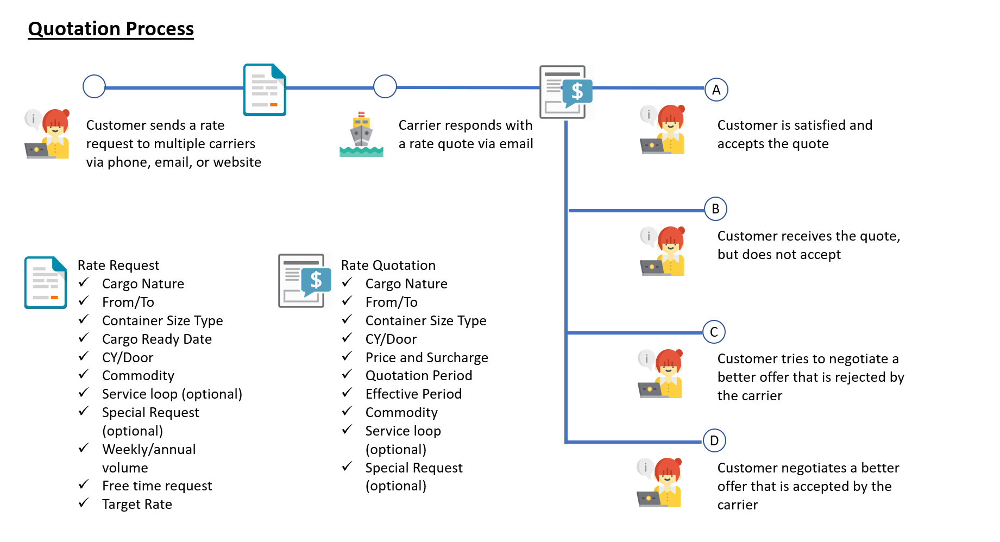
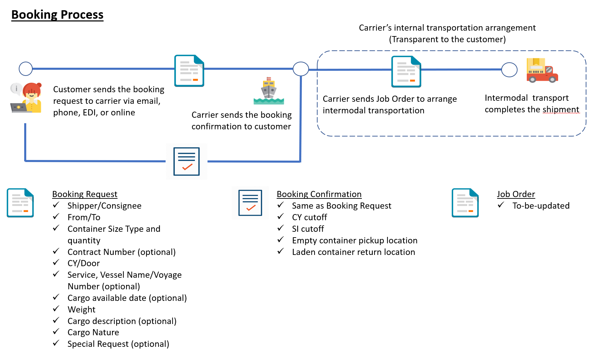
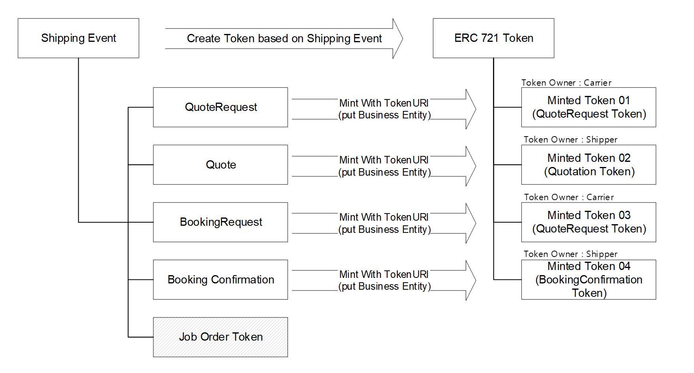
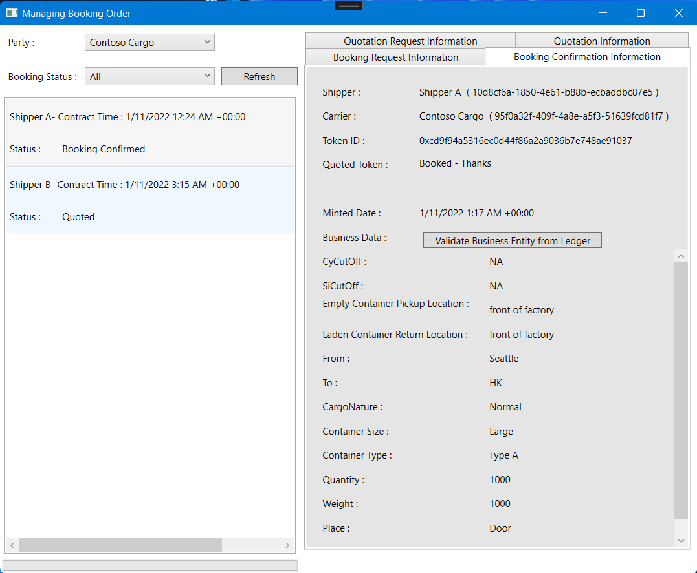
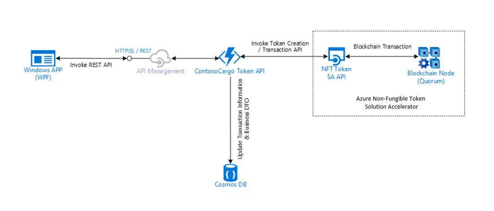

# Digital Documentation for the Shipping Industry Solution Accelerator

## About this Repository

Today’s supply chains depend on a growing list of international and domestic partners.  

To better meet customer demand and keep the increasingly complex systems running smoothly leaders are turning to intelligent shipping documentation.
Digital documentation solutions that leverage the unique advantages of blockchain technology deliver improved speed and agility, while also providing transparency and traceability to internal and external stakeholders.  

The Digital Documentation for the Shipping Industry Solution Accelerator shows you how to complete shipping agreements faster, with improved security, when transacting with new and existing customers all over the world.
The solution uses a private blockchain network to document every step of the order process in a way that improves the overall experience for everyone involved.

Through the use of a secure, distributed, immutable, and automatable network of blockchain platforms, every business transaction between shippers and carriers is tokenized and shared. 
Use of blockchain technology practically eilminates the risk of data tampering in the shipment order process, between quotation and booking, as every business participant can access the shared ledger of transaction events.
This solution accelerator is focused on the shipping industry, though with a little imagination it can serve as model for any number of use cases in a multitude of industries. 

### Traditional Shipping Process 
---

Traditional shipping industry processes are fragmented, with limited data sharing between quotation and booking workflows.  

  


  


### Unified Shipping Process  
---

This accelerator shows how the traditional order and quotation processes can be made more agile within full and/or semi-trusted business relationships.  
This new technology can reduce the time needed to complete business deals and empowers companies to easily and securely negotiate rates with new customers all over the world.  

​While this accelerator was built to improve transparency within the shipping industry, it is applicable to almost any business process that requires transparency and traceability among participants.

The diagram below shows how traditional processes can be consolidated and managed as a single process using NFT Tokens.

  


This screenshot summarizes how NFT tokens can be used to efficiently manage quoting and order confirmation for shipping companies,
making contract conditions and related information available to all participants. It is easy to see how this solution can be extended to provide visiblity on the entire delivery process.

  
  


## Prerequisites

In order to successfully complete your solution, you will need to have access to or provision the following:  
1. [Access to an Azure Subscription](http://portal.azure.com), with required permissions - Required to deploy compute resources
2. [Visual Studio 2019 or newer version](https://visualstudio.microsoft.com/downloads/)
3. [Azure CLI](https://docs.microsoft.com/en-us/cli/azure/install-azure-cli) installed - Required for deployment scripts to be run
5. [Azure Functions Core Tools](https://docs.microsoft.com/en-us/azure/azure-functions/functions-run-local?tabs=v4%2Cwindows%2Ccsharp%2Cportal%2Cbash#v2)


## Architectural Overview

After completion of all steps, you will have a working end-to-end solution with the following architecture:




## Azure and Blockchain

The directions provided in this repository assume a fundamental working knowledge of Azure. The resources needed for this solution are Cosmos DB, and Azure Functions.   

This SA leverages [Azure Non-Fungible Token Solution Accelerator](https://github.com/microsoft/Azure-Non-Fungible-Token-Solution-Accelerator) for implementing NFT transactions more quickly. Please review  Azure Non-Fungible Token Solution Accelerator before you begin this project.

For additional training and support, please see:
 1. [Azure Cosmos DB](https://docs.microsoft.com/en-us/azure/cosmos-db/introduction)
 2. [Azure Functions](https://azure.microsoft.com/en-us/services/functions/) 
 3. [Azure Non-Fungible Token Solution Accelerator](https://github.com/microsoft/Azure-Non-Fungible-Token-Solution-Accelerator)
 
## Getting Started

1. Clone/download this repo onto your computer and then walk through each of these steps in order, following the steps outlined in each of the README files.

1. Deploy the needed [resources](./deployments/ARMTemplates/README.md) 
    - The resources in this folder can be used to deploy the required cloud services into your Azure Subscription. This can be done either via the [Azure Portal](https://portal.azure.com) or by using the [PowerShell script](./deployments/ARMTemplates/Bicep/resourcedeployment.ps1) included in the deployment folder.

    - After resource deployment, you will have an Azure Function App, Azure App Service Plan, Azure Storage Account, Azure Cosmos DB Account, and Azure Managed Identity.

    - Resources can also be deployed into your Azure Subscription by using one of these Deploy Azure links:  

        [](https://portal.azure.com/#create/Microsoft.Template/uri/https%3A%2F%2Fraw.githubusercontent.com%2Fmicrosoft%2FDigital-Documentation-Shipping-Industry-Solution-Accelerator%2Fmaster%2Fdeployments%2FARMTemplates%2FJson%2Fmain.json)&emsp;&emsp;&emsp;
        [](https://portal.azure.us/#create/Microsoft.Template/uri/https%3A%2F%2Fraw.githubusercontent.com%2Fmicrosoft%2FDigital-Documentation-Shipping-Industry-Solution-Accelerator%2Fmaster%2Fdeployments%2FARMTemplates%2FJson%2Fmain.json)&emsp;&emsp;&emsp;

        **Note: Follow "Step 3" in [Azure Resources Deployment](./deployments/ARMTemplates/README.md#step-3-configure-and-assign-managed-identity) to configure managed identity permission if you have deployed resources using above Azure links.**

1. Deploy the [Azure Functions](./deployments/AzureFunctions/README.md) using a [PowerShell script](./deployments/AzureFunctions/deployazurefunction.ps1) that will deploy source code from the repo to Azure Functions.  

1. Deploy the [sample client application](./documents/README.md) to test and demonstrate the solution.  

## Folders


### [Resource Deployment](./deployments/ARMTemplates)
Contains resource deployment scripts to deploy the resources required to complete this project. 

### [Application Deployment](./deployments/AzureFunctions)
This folder contains deployment scripts need to setup the token API

### [Source](./src)
This folder contains all source code for Contoso Cargo sample application. 


## Microsoft Open Source Code of Conduct

This project has adopted the [Microsoft Open Source Code of Conduct](https://opensource.microsoft.com/codeofconduct/).

Resources:

- [Microsoft Open Source Code of Conduct](https://opensource.microsoft.com/codeofconduct/)
- [Microsoft Code of Conduct FAQ](https://opensource.microsoft.com/codeofconduct/faq/)
- Contact [opencode@microsoft.com](mailto:opencode@microsoft.com) with questions or concerns

## License

Copyright (c) Microsoft Corporation

All rights reserved.

MIT License

Permission is hereby granted, free of charge, to any person obtaining a copy of this software and associated documentation files (the ""Software""), to deal in the Software without restriction, including without limitation the rights to use, copy, modify, merge, publish, distribute, sublicense, and/or sell copies of the Software, and to permit persons to whom the Software is furnished to do so, subject to the following conditions:

The above copyright notice and this permission notice shall be included in all copies or substantial portions of the Software.

THE SOFTWARE IS PROVIDED AS IS, WITHOUT WARRANTY OF ANY KIND, EXPRESS OR IMPLIED, INCLUDING BUT NOT LIMITED TO THE WARRANTIES OF MERCHANTABILITY, FITNESS FOR A PARTICULAR PURPOSE, AND NON-INFRINGEMENT. IN NO EVENT SHALL THE AUTHORS OR COPYRIGHT HOLDERS BE LIABLE FOR ANY CLAIM, DAMAGES, OR OTHER LIABILITY, WHETHER IN AN ACTION OF CONTRACT, TORT, OR OTHERWISE, ARISING FROM, OUT OF, OR IN CONNECTION WITH THE SOFTWARE OR THE USE OR OTHER DEALINGS IN THE SOFTWARE


## Security

Microsoft takes the security of our software products and services seriously, which includes all source code repositories managed through our GitHub organizations, which include [Microsoft](https://github.com/Microsoft), [Azure](https://github.com/Azure), [DotNet](https://github.com/dotnet), [AspNet](https://github.com/aspnet), [Xamarin](https://github.com/xamarin), and [our GitHub organizations](https://opensource.microsoft.com/).

If you believe you have found a security vulnerability in any Microsoft-owned repository
 that meets Microsoft's [Microsoft's definition of a security vulnerability](https://docs.microsoft.com/en-us/previous-versions/tn-archive/cc751383(v=technet.10)), 
 please report it to us as described here: [Reporting Security Issues](./SECURITY.md)

**Please do not report security vulnerabilities through public GitHub issues or any other public forumn.**

## Privacy

When you deploy this template, Microsoft is able to identify the installation of the software with the Azure resources that are deployed. Microsoft is able to correlate the Azure resources that are used to support the software. Microsoft collects this information to provide the best experiences with their products and to operate their business. The data is collected and governed by Microsoft's privacy policies, which can be found at [Microsoft Privacy Statement](https://go.microsoft.com/fwlink/?LinkID=824704).

To disable this, simply remove the following section from [main.json](/deployments/ARMTemplates/Json/main.json) before deploying the resources to Azure:

```json
{
    "type": "Microsoft.Resources/deployments",
    "apiVersion": "2021-04-01",
    "name": "pid-b467f153-9bc9-5631-adb5-3eefa231a547",
    "properties": {
    "mode": "Incremental",
    "template": {
        "$schema": "https://schema.management.azure.com/schemas/2019-04-01/deploymentTemplate.json#",
        "contentVersion": "1.0.0.0",
        "resources": []
    }
    }
}
```

You can see more information on this at https://docs.microsoft.com/en-us/azure/marketplace/azure-partner-customer-usage-attribution.


## Contributing

This project welcomes contributions and suggestions.  Most contributions require you to agree to a
Contributor License Agreement (CLA) declaring that you have the right to, and actually do, grant us
the rights to use your contribution. For details, visit https://cla.microsoft.com.

When you submit a pull request, a CLA-bot will automatically determine whether you need to provide
a CLA and decorate the PR appropriately (e.g., label, comment). Simply follow the instructions
provided by the bot. You will only need to do this once across all repos using our CLA.

This project has adopted the [Microsoft Open Source Code of Conduct](https://opensource.microsoft.com/codeofconduct/).
For more information see the [Code of Conduct FAQ](https://opensource.microsoft.com/codeofconduct/faq/) or
contact [opencode@microsoft.com](mailto:opencode@microsoft.com) with any additional questions or comments.  

## Support

### How to file issues and get help  

This project uses GitHub Issues to track bugs and feature requests. Please search the existing 
issues before filing new issues to avoid duplicates.  For new issues, file your bug or 
feature request as a new Issue.


### Microsoft Support Policy  

Support for this project is limited to the resources listed above.

## Trademarks

This project may contain trademarks or logos for projects, products, or services. Authorized use of Microsoft 
trademarks or logos is subject to and must follow 
[Microsoft's Trademark & Brand Guidelines](https://www.microsoft.com/en-us/legal/intellectualproperty/trademarks/usage/general).
Use of Microsoft trademarks or logos in modified versions of this project must not cause confusion or imply Microsoft sponsorship.
Any use of third-party trademarks or logos are subject to those third-party's policies.


## Notices

Do Not Translate or Localize

This software incorporates material from third parties.
Microsoft makes certain open source code available at https://3rdpartysource.microsoft.com,
or you may send a check or money order for US $5.00, including the product name,
the open source component name, platform, and version number, to:

Source Code Compliance Team  
Microsoft Corporation  
One Microsoft Way  
Redmond, WA 98052  
USA  

Notwithstanding any other terms, you may reverse engineer this software to the extent
required to debug changes to any libraries licensed under the GNU Lesser General Public License.
