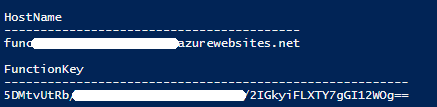
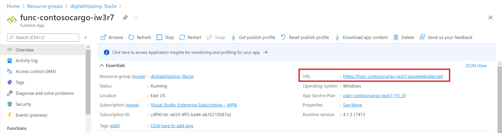
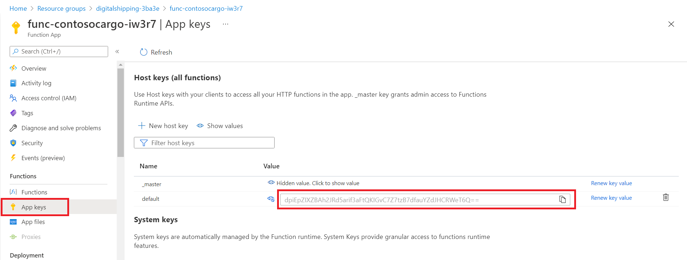
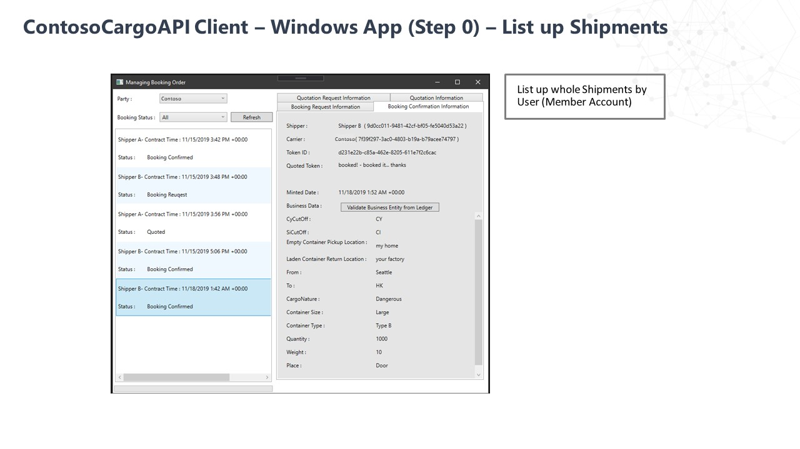

# Setup and Deploy Sample Console Application

This folder contains documentation on how to run the sample application to demonstrate the Digital Shipping Documentation solution.

 
## Prerequisites
1. Access to an Azure subscription
1. Fundamental knowledge and access to [Visual Studio](https://visualstudio.microsoft.com/)

## How to run Console Application in Azure

To run the [source code](../src):

1. Clone/download the [source code](../src) onto your computer and open the folder in Visual Studio.
2. Open the [ContosoCargo.DigitalDocument.TokenService.sln](../src/ContosoCargo.DigitalDocument.TokenService.sln).
3. Navgate to ContosoCargo.DigitalDocument.Setup > appsettings.json
4. Replace TokenServiceEndpoint and BlockchainNetworkTxNode which it is recevied during [azure non fungible token solution accelerator](https://github.com/microsoft/Azure-Non-Fungible-Token-Solution-Accelerator) deployment.
5. Set the ContosoCargo.DigitalDocument.Setup as your start up project and run the solution.
6. Once the application runs successfully, at the end following values will be received.
   - Contoso Cargo Id        : 324ee982-a87d-43c8-affb-07758e732044
   - Shipper A Id            : de5f8ad5-2130-47e3-84f6-4f703b687233
   - Shipper B Id            : 44eef836-0292-4d84-94b3-665c7079011b
   - **Note: Above given value will be different everytime we the run ContosoCargo.DigitalDocument.Setup application.**
7. Copy the detail received as they will be need for next applicaiton. Now stop the running application.
8. Navigate to ContosoCargo.DigitalDocument.Application.WindowsClient > App.config.
9. Replace HostKey and ServiceEndpoint with your Azure Functions
   - When [azure functions deployed](../deployments/AzureFunctions/README.md) at the end of deployemnt HostKey and ServiceEndpoint has been received.
    
   - If not coppied after deployemnt, it can get from azure portal.
   - Copy ServiceEndpoint from azure portal.
       
   - Copy HostKey from azure portal.
       
   -**Note:** Don't forget **/api** on the end! (e.g. _https://contosocargo.azurewebsites.net/api_)
10. Replace ContosoCargo_Id, ShipperA_Id and ShipperB_Id which is received while running Setup application.
10. Set the Application.WindowsClient as your start up project and run the solution.

## How to use the Application

The first time the client app will open up to 'Contoso Cargo' as the Party and there should be no quotes created yet. Once there are shipping quotes, the client should look like this:

### 1. Start with a shipper creating a quote request:

### 2. The carrier will respond with a quotation:

### 3. The shipper will book the request:

### 4. The carrier will confirm the request:
